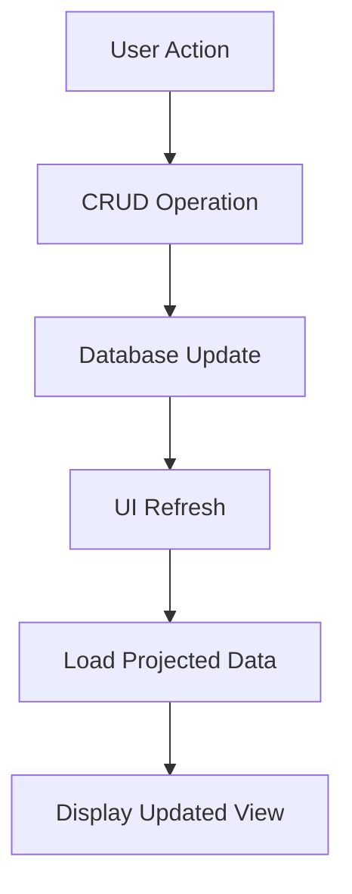

# Transaction CRUD Operations & Future Month Viewing Guide

## Overview

This guide documents the improved CRUD (Create, Read, Update, Delete) operations for transactions and recurring transactions, along with the new future month viewing functionality that shows projected recurring transactions.

## 🚀 Key Improvements

### 1. **Simplified CRUD Operations**

- **New Service**: `transactionService.ts` provides clean, simple CRUD operations
- **Better Error Handling**: Comprehensive error handling with user-friendly messages
- **Type Safety**: Full TypeScript support with proper interfaces
- **Performance**: Optimized database queries and caching

### 2. **Future Month Viewing**

- **Projected Transactions**: See what recurring transactions will appear in future months
- **Visual Indicators**: Projected transactions are clearly marked with different styling
- **Real-time Updates**: Totals automatically include projected transactions for future months
- **No Database Pollution**: Projected transactions are calculated on-the-fly, not stored
- **Manual Control**: Users can manually generate transactions when needed

### 3. **Enhanced User Experience**

- **Intuitive Navigation**: Easy month navigation with arrow buttons (no automatic generation)
- **Clear Visual Distinction**: Actual vs projected transactions are visually separated
- **Smart Totals**: Future month totals include both actual and projected transactions
- **Manual Generation**: Users have full control over when transactions are created
- **Responsive Design**: Works seamlessly across different screen sizes

## 📁 File Structure

```
src/
├── services/
│   ├── transactionService.ts          # New simplified CRUD service
│   └── userData.ts                    # Enhanced with projection functions
├── screens/
│   └── BudgetScreen.tsx               # Updated with future month viewing
└── components/
    └── TransactionCRUDExample.tsx     # Example component demonstrating CRUD
```

## 🔧 API Reference

### Transaction CRUD Operations

```typescript
// Create a new transaction
const transactionId = await createTransaction({
  description: "Grocery shopping",
  amount: 150.0,
  type: "expense",
  category: "Food",
  date: Date.now(),
  userId: "user123",
});

// Get all transactions for a user
const transactions = await getTransactions("user123");

// Get transactions for a specific month
const monthlyTransactions = await getTransactionsForMonth(
  "user123",
  new Date()
);

// Update a transaction
await updateTransaction({
  id: "transaction123",
  description: "Updated description",
  amount: 200.0,
  type: "expense",
  category: "Food",
  date: Date.now(),
  userId: "user123",
});

// Delete a transaction
await deleteTransaction("user123", "transaction123");
```

### Recurring Transaction CRUD Operations

```typescript
// Create a new recurring transaction
const recurringId = await createRecurringTransaction({
  name: "Monthly Rent",
  amount: 1200.0,
  type: "expense",
  category: "Housing",
  frequency: "monthly",
  startDate: Date.now(),
  isActive: true,
  userId: "user123",
});

// Get all recurring transactions
const recurringTransactions = await getRecurringTransactions("user123");

// Update a recurring transaction
await updateRecurringTransaction({
  id: "recurring123",
  name: "Updated Rent",
  amount: 1300.0,
  type: "expense",
  category: "Housing",
  frequency: "monthly",
  startDate: Date.now(),
  isActive: true,
  userId: "user123",
});

// Delete a recurring transaction
await deleteRecurringTransaction("recurring123");

// Generate transactions for a specific month
await generateTransactionsForMonth("user123", new Date());
```

### Future Month Projections

```typescript
// Get projected transactions for any month
const { actual, projected } = await getProjectedTransactionsForMonth(
  "user123",
  new Date()
);

// actual: Array of real transactions for the month
// projected: Array of projected recurring transactions that will occur
```

## 🎯 Usage Examples

### 1. Basic Transaction Management

```typescript
import {
  createTransaction,
  getTransactions,
} from "../services/transactionService";

// Create a transaction
const newTransaction = {
  description: "Coffee",
  amount: 5.5,
  type: "expense",
  category: "Food",
  date: Date.now(),
  userId: user.uid,
};

const transactionId = await createTransaction(newTransaction);

// Get all transactions
const allTransactions = await getTransactions(user.uid);
```

### 2. Recurring Transaction Setup

```typescript
import { createRecurringTransaction } from "../services/transactionService";

// Set up monthly rent payment
const rentPayment = {
  name: "Rent Payment",
  amount: 1200.0,
  type: "expense",
  category: "Housing",
  frequency: "monthly",
  startDate: Date.now(),
  isActive: true,
  userId: user.uid,
};

await createRecurringTransaction(rentPayment);
```

### 3. Viewing Future Months

```typescript
import { getProjectedTransactionsForMonth } from "../services/transactionService";

// Get next month's projected transactions
const nextMonth = new Date();
nextMonth.setMonth(nextMonth.getMonth() + 1);

const { actual, projected } = await getProjectedTransactionsForMonth(
  user.uid,
  nextMonth
);

console.log(`Actual transactions: ${actual.length}`);
console.log(`Projected transactions: ${projected.length}`);
```

### 4. Generating Transactions for Current Month

```typescript
import { generateTransactionsForMonth } from "../services/transactionService";

// Generate all recurring transactions for the current month
await generateTransactionsForMonth(user.uid, new Date());
```

## 🎨 UI Components

### BudgetScreen Enhancements

The `BudgetScreen` now includes:

1. **Month Navigation**: Previous/Next month buttons
2. **Projected Transactions Section**: Shows recurring transactions that will occur in future months
3. **Visual Indicators**:
   - Actual transactions: Normal styling
   - Projected transactions: Slightly transparent with clock icon
4. **Smart Totals**: Includes both actual and projected transactions in calculations

### TransactionCRUDExample Component

A complete example component demonstrating all CRUD operations:

- ✅ Create transactions and recurring transactions
- ✅ Read/display all transactions
- ✅ Update existing transactions
- ✅ Delete transactions with confirmation
- ✅ View projected transactions for future months

## 🔄 Data Flow



## 🛡️ Error Handling

All operations include comprehensive error handling:

```typescript
try {
  await createTransaction(transaction);
  Alert.alert("Success", "Transaction created successfully!");
} catch (error) {
  console.error("Error creating transaction:", error);
  Alert.alert("Error", "Failed to create transaction");
}
```

## 🚀 Performance Optimizations

1. **Efficient Queries**: Only fetch necessary data
2. **Smart Caching**: Cache projected calculations
3. **Lazy Loading**: Load projected data only when needed
4. **Optimistic Updates**: Update UI immediately, sync in background

## 🔧 Configuration

### Firebase Rules

Ensure your Firebase rules support the new operations:

```json
{
  "rules": {
    "users": {
      "$userId": {
        "transactions": {
          "$transactionId": {
            ".read": "auth != null && auth.uid === $userId",
            ".write": "auth != null && auth.uid === $userId"
          }
        }
      }
    },
    "recurringTransactions": {
      "$recurringId": {
        ".read": "auth != null && data.child('userId').val() === auth.uid",
        ".write": "auth != null && newData.child('userId').val() === auth.uid"
      }
    }
  }
}
```

## 🧪 Testing

### Manual Testing Checklist

- [ ] Create a new transaction
- [ ] Edit an existing transaction
- [ ] Delete a transaction
- [ ] Create a recurring transaction
- [ ] Edit a recurring transaction
- [ ] Delete a recurring transaction
- [ ] Navigate to future months
- [ ] Verify projected transactions appear
- [ ] Check that totals include projected amounts
- [ ] Test error handling with invalid data

### Unit Testing

```typescript
// Example test for transaction creation
describe("Transaction CRUD", () => {
  it("should create a transaction successfully", async () => {
    const transaction = {
      description: "Test",
      amount: 100,
      type: "expense",
      category: "Test",
      date: Date.now(),
      userId: "testUser",
    };

    const result = await createTransaction(transaction);
    expect(result).toBeDefined();
  });
});
```

## 📈 Future Enhancements

1. **Bulk Operations**: Import/export transactions
2. **Advanced Filtering**: Filter by date range, category, amount
3. **Recurring Transaction Templates**: Pre-defined templates for common recurring transactions
4. **Smart Suggestions**: AI-powered transaction categorization
5. **Offline Support**: Work without internet connection
6. **Data Analytics**: Spending patterns and insights

## 🤝 Contributing

When contributing to the transaction CRUD functionality:

1. Follow the existing code patterns
2. Add proper error handling
3. Include TypeScript types
4. Update this documentation
5. Add tests for new functionality

## 📞 Support

For questions or issues with the transaction CRUD operations:

1. Check the error logs in the console
2. Verify Firebase rules are correct
3. Ensure user authentication is working
4. Test with the `TransactionCRUDExample` component

---

**Note**: This implementation provides a solid foundation for transaction management while maintaining good performance and user experience. The projected transaction feature gives users valuable insights into their future financial commitments.
